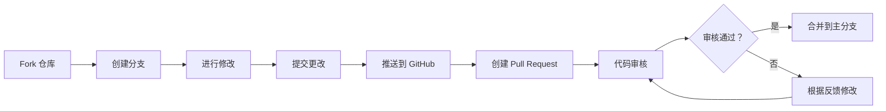

# 🤝 贡献指南

感谢你考虑为 **OpenClaw Workspace** 做出贡献！🎉

本指南将帮助你了解如何参与项目开发。

---

## 📖 目录

- [行为准则](#-行为准则)
- [如何贡献](#-如何贡献)
- [开发环境设置](#-开发环境设置)
- [代码规范](#-代码规范)
- [提交规范](#-提交规范)
- [Pull Request 流程](#-pull-request-流程)
- [问题反馈](#-问题反馈)
- [常见问题](#-常见问题)

---

## 🎯 行为准则

本项目采用 **Contributor Covenant** 行为准则。

**我们的承诺**:
- ✅ 营造开放、友好、专业的环境
- ✅ 尊重不同观点和经验
- ✅ 优雅地接受建设性批评
- ✅ 关注对社区最有利的事情
- ✅ 对其他社区成员表示同理心

**不可接受的行为**:
- ❌ 使用性化的语言或图像
- ❌ 人身攻击或侮辱性评论
- ❌ 公开或私下骚扰
- ❌ 未经许可发布他人信息
- ❌ 其他不道德或不专业的行为

---

## 🚀 如何贡献

### 1️⃣ 第一次贡献？

如果你是第一次参与开源项目，推荐：
- 📚 阅读 [GitHub 贡献指南](https://docs.github.com/en/get-started/exploring-projects-on-github/contributing-to-a-project)
- 🔍 寻找标有 `good first issue` 的 Issue
- 💬 在 Issue 中留言表示你想参与
- 🤝 我们会提供指导和支持

### 2️⃣ 贡献流程



### 3️⃣ 快速开始

```bash
# 1. Fork 仓库
# 在 GitHub 上点击 Fork 按钮

# 2. 克隆到本地
git clone https://github.com/YOUR_USERNAME/openclaw-workspace.git
cd openclaw-workspace

# 3. 创建分支
git checkout -b feature/your-feature-name

# 4. 进行修改
# 编辑代码、添加测试、更新文档

# 5. 提交更改
git add .
git commit -m "feat: 添加新功能"

# 6. 推送到 GitHub
git push origin feature/your-feature-name

# 7. 创建 Pull Request
# 在 GitHub 上点击 "New Pull Request"
```

---

## 🛠️ 开发环境设置

### 系统要求

| 组件 | 版本 | 说明 |
|------|------|------|
| Python | 3.14+ | 主要开发语言 |
| Git | 2.0+ | 版本控制 |
| Node.js | 18+ | (可选) 前端开发 |
| Docker | 20+ | (可选) 容器化部署 |

### 安装步骤

```bash
# 1. 克隆仓库
git clone https://github.com/pangxianggang/openclaw-workspace.git
cd openclaw-workspace

# 2. 创建虚拟环境
python -m venv venv
source venv/bin/activate  # Linux/macOS
# 或
.\venv\Scripts\activate  # Windows

# 3. 安装依赖
pip install -r requirements.txt
pip install -r requirements-dev.txt  # 开发依赖

# 4. 运行测试
pytest

# 5. 启动服务
python main.py
```

---

## 📝 代码规范

### Python 代码

遵循 [PEP 8](https://pep8.org/) 规范：

```python
# ✅ 好的命名
def calculate_user_score(user_id: int) -> float:
    """计算用户分数"""
    pass

# ❌ 避免的命名
def calc(uid):
    pass

# ✅ 使用类型注解
def process_data(data: List[Dict[str, Any]]) -> Dict[str, int]:
    pass

# ✅ 添加文档字符串
class MemoryBank:
    """记忆银行系统 - 管理和存储 AI 记忆"""
    
    def save_memory(self, content: str) -> str:
        """
        保存记忆到系统
        
        Args:
            content: 记忆内容
            
        Returns:
            记忆 ID
        """
        pass
```

### 代码风格

```python
# 导入顺序
import os  # 标准库
import sys

import requests  # 第三方库
from fastapi import FastAPI

import local_module  # 本地模块

# 代码格式
# ✅ 好的格式
def process_items(items: List[str], max_count: int = 10) -> List[str]:
    """处理项目列表"""
    if not items:
        return []
    
    result = [item.upper() for item in items[:max_count]]
    return result

# ❌ 避免的格式
def process_items(items,max_count=10):
    if not items:return []
    result=[item.upper() for item in items[:max_count]]
    return result
```

### 测试规范

```python
# 测试文件命名：test_*.py
# 测试函数命名：test_*

def test_memory_save():
    """测试记忆保存功能"""
    # Given
    memory_content = "测试内容"
    
    # When
    memory_id = memory_bank.save(memory_content)
    
    # Then
    assert memory_id is not None
    assert len(memory_id) > 0
```

---

## 📤 提交规范

### Commit Message 格式

遵循 [Conventional Commits](https://www.conventionalcommits.org/) 规范：

```
<类型>(<范围>): <主题>

<正文>

<页脚>
```

### 类型说明

| 类型 | 说明 | 示例 |
|------|------|------|
| `feat` | 新功能 | `feat(memory): 添加记忆搜索功能` |
| `fix` | Bug 修复 | `fix(api): 修复 API 认证错误` |
| `docs` | 文档更新 | `docs(readme): 更新安装说明` |
| `style` | 代码格式 | `style(format): 格式化代码` |
| `refactor` | 代码重构 | `refactor(core): 重构核心模块` |
| `test` | 测试相关 | `test(memory): 添加记忆测试` |
| `chore` | 构建/工具 | `chore(deps): 更新依赖版本` |
| `perf` | 性能优化 | `perf(query): 优化查询性能` |
| `ci` | CI/CD | `ci(github): 添加 GitHub Actions` |

### 提交示例

```bash
# ✅ 好的提交信息
git commit -m "feat(memory): 添加记忆搜索功能

- 实现全文搜索
- 支持标签过滤
- 添加搜索结果排序

Fixes #123"

# ❌ 避免的提交信息
git commit -m "更新代码"
git commit -m "fix bug"
git commit -m "asdfasdf"
```

---

## 🔀 Pull Request 流程

### 1️⃣ 创建 PR

1. 在 GitHub 上创建 Pull Request
2. 填写 PR 模板（自动生成）
3. 关联相关 Issue
4. 添加适当的标签

### 2️⃣ PR 要求

**必须完成**:
- [ ] 代码通过所有测试
- [ ] 添加了必要的测试
- [ ] 更新了相关文档
- [ ] 代码符合规范
- [ ] 没有引入警告

**建议完成**:
- [ ] 添加了示例代码
- [ ] 更新了 CHANGELOG
- [ ] 添加了截图（如有 UI 改动）

### 3️⃣ 审核流程

```
提交 PR
  ↓
自动检查 (CI/CD)
  ↓
维护者审核
  ↓
{ 通过？ }
  ├─ 是 → 合并到主分支
  └─ 否 → 根据反馈修改 → 重新审核
```

**审核时间**: 通常在 2-3 个工作日内

### 4️⃣ 合并策略

- **Squash and Merge**: 将多个提交压缩为一个
- **Rebase and Merge**: 变基后合并
- **Create a Merge Commit**: 创建合并提交

默认使用 **Squash and Merge** 保持历史清晰。

---

## ❓ 问题反馈

### 报告 Bug

1. 搜索现有 Issue，避免重复
2. 使用 [Bug 报告模板](.github/ISSUE_TEMPLATE/bug_report.md)
3. 提供详细信息：
   - 环境信息（OS、Python 版本等）
   - 复现步骤
   - 错误日志
   - 截图（如适用）

### 提出功能建议

1. 搜索现有 Issue，避免重复
2. 使用 [功能请求模板](.github/ISSUE_TEMPLATE/feature_request.md)
3. 说明：
   - 使用场景
   - 解决的问题
   - 实现建议（如有）

---

## 📚 常见问题

### Q: 我应该如何开始？

A: 从 `good first issue` 标签的 Issue 开始，这些是适合新手的任务。

### Q: 我的 PR 多久会被审核？

A: 通常在 2-3 个工作日内。如果超过一周没有回复，可以礼貌地 @ 维护者。

### Q: 我可以添加新功能吗？

A: 当然！请先创建一个 Issue 讨论你的想法，确认后再开始开发。

### Q: 如何运行测试？

A: 
```bash
# 运行所有测试
pytest

# 运行特定测试
pytest tests/test_memory.py

# 查看测试覆盖率
pytest --cov=src
```

### Q: 代码风格有问题怎么办？

A: 使用自动格式化工具：
```bash
# 格式化代码
black src/
isort src/

# 检查代码风格
flake8 src/
pylint src/
```

---

## 🏆 贡献者权益

- ✅ 在 README 中列出贡献者名单
- ✅ 获得项目社区的认可
- ✅ 提升个人技术影响力
- ✅ 学习最佳实践
- ✅ 建立开源作品集

---

## 📞 联系方式

- **GitHub**: [@pangxianggang](https://github.com/pangxianggang)
- **Email**: pangxianggang@outlook.com
- **Issue**: [提交 Issue](https://github.com/pangxianggang/openclaw-workspace/issues)
- **Discussion**: [社区讨论](https://github.com/pangxianggang/openclaw-workspace/discussions)

---

## 📜 许可证

本项目采用 [MIT License](LICENSE)。

---

**再次感谢你的贡献！🎉**

_本贡献指南参考了多个优秀开源项目，如有雷同，纯属致敬。_
